# 1 AIによる画像生成について

# 2 zksyncEra Testnetの課題と現状

## 0 導入の理由

Ethereumは「ブロックチェーンのトリレンマ」のうち、「セキュリティ」「分散化」を重視しているため、「スケーラビリティ」に課題が残っています。

zkEVMはこの「セキュリティ」と「分散化」を損なうことなく、「スケーラビリティ」を解決する手段の一つであるため、採用しました。

## 1 作成済みURL

NFT画像の表示とメタマスクによるclaimを行います。

zksync Era Testnetで作成したプロジェクトはこちらです。


https://zksync-era-testnet-garelly.vercel.app/

zksync Era Testnetのコントラクトはこちら

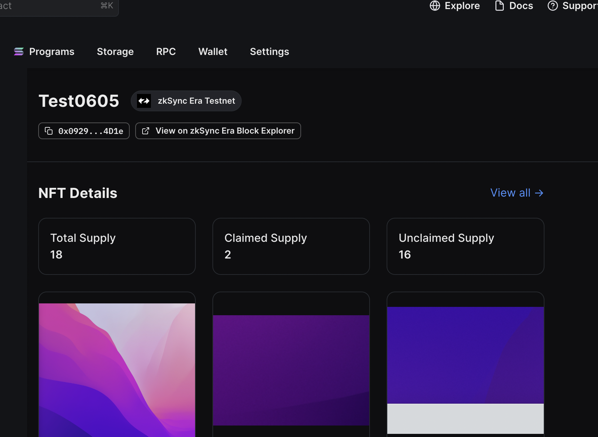

https://thirdweb.com/zksync-era-testnet/0x0929624DFbFdA73cdC67dfEEA269003d380A4D1e

## 2 スマートウォレットについて

thirdwebのアカウントアブストラクション作成のコントラクトである「Simple Wallet Factory (beta)」がzksyncEra Testnetで未対応。

https://thirdweb.com/thirdweb.eth/AccountFactory

そのため、この機能はmumbaiで作ることとしました。

## 3 ローカルウォレットについて

ローカルウォレットの実装は可能でしたが、ガスレストランザクションで未対応箇所があったため、mumbaiで作りました。

当初考えていた構成は次のようになります。

### 1. thirdwebの機能を使い、ローカルウォレット作成　⇨　可能

### 2. OpenZeppelin Defenderによるリレイヤー・オートタスクの作成　⇨ 可能

### 3. thirdwebによるフォワーダー使用　⇨　zksyncEra Testnet 未対応


https://github.com/thirdweb-dev/ozdefender-autotask?ref=blog.thirdweb.com


# 3 ローカルウォレットとスマートウォレットについて

## 1 ローカルウォレットについて

### 0.導入の理由

現状、「メタマスク」などのウォレットを持っていない場合、NFT配布イベントなどに参加することが困難です。

その場で暫定的なウォレットを作成する「ローカルウォレット」を採用することで、メタマスクなどのウォレットを持っていない層の参加を見込むことができます。

### 1.処理の流れ(概要)について
Webページからその場でローカルウォレットを作成し、ガスレストランザクションを利用して、NFTを取得します。


### 2.処理の流れ（詳細）について

「Connect Wallet」押下時に「continue as guest」を選択し、ローカルウォレットを作成画面に遷移します。
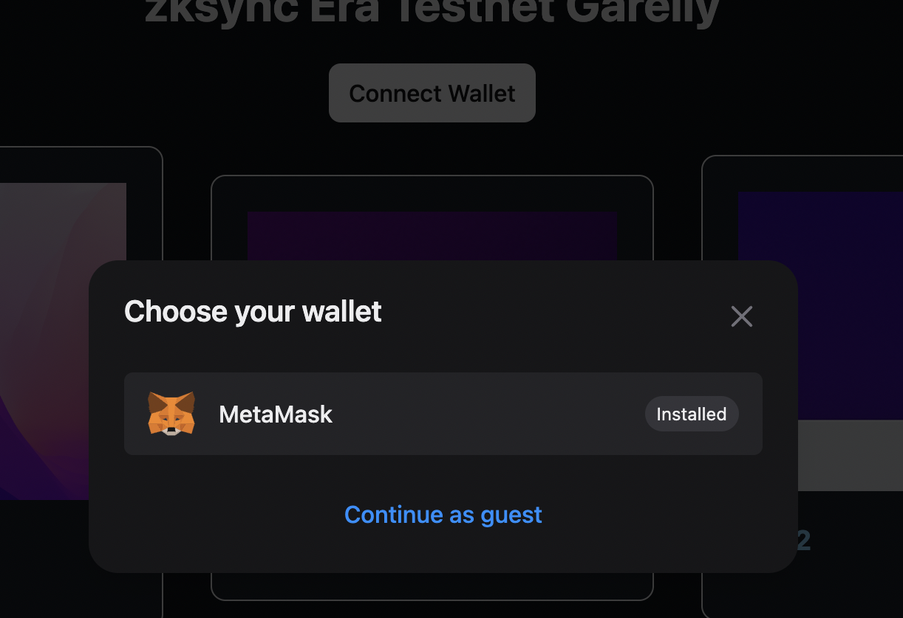

任意のパスワードを設定した上で、「Create a new wallet」を選択します。
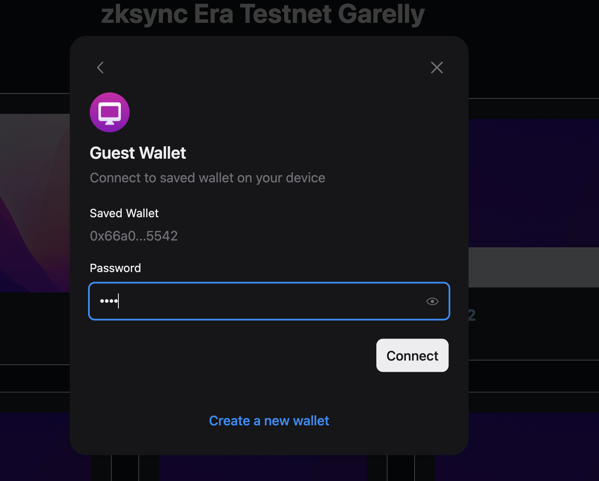

「Backup wallet」を押下することで、ローカルウォレットの情報を保存します。
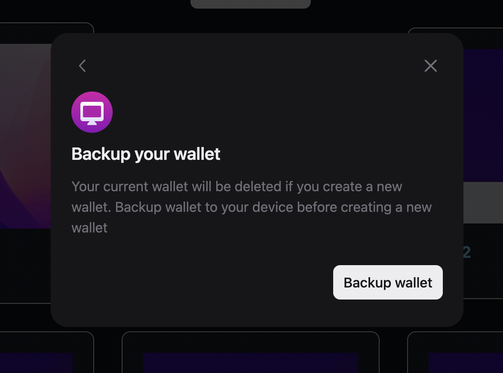

なお、この保存情報の内容は下の記事にまとめています。

https://note.com/standenglish/n/nadf776c67084

以上で、ローカルウォレットが完成しました。

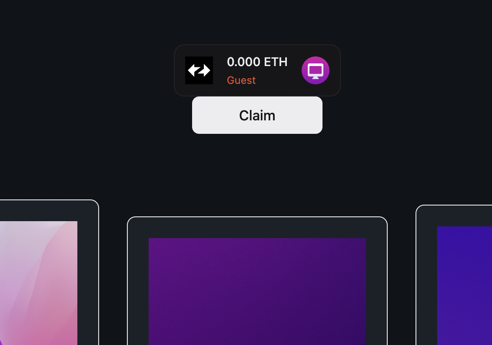

作成したばかりのウォレットであるため、ガス代がありません。

ガス代については、OpenZeppelin Defenderを使用することにより、ガスレストランザクションを実現しています。

### 3.ガスレストランザクションについて

今回のコードはthirdweb SDKを使用しています。

「sdkOptions」から「relayerURL」を指定することで、ガスレストランザクションを実現しています。

```ts:_app.tsx
<ThirdwebProvider 
      activeChain={activeChain}
      supportedWallets={[
        metamaskWallet(),
        localWallet(),
      ]}
      sdkOptions={{
        gasless: {
          openzeppelin: {
            relayerUrl: "https://api.defender.openzeppelin.com/autotasks/e200a696-25ba-4c62-bc11-33707a1e724c/runs/webhook/9b4a6556-3f26-4b6a-8638-3c305d501266/T8PpSHE1DH2QCAW4BLADvo"
          }
        }
      }}
>
```

「OpenZeppelin Defender」の「Relay」でガスを代わりに支払うウォレットを作成します。

「Autotask」において、webhookを作成します。

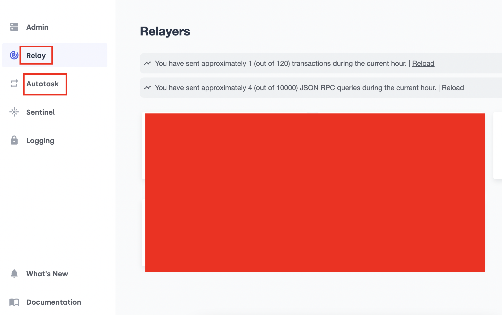

## 2 スマートウォレットについて

### 0.導入の理由

量子コンピュータの発展により、将来、公開鍵から秘密鍵が理論上導かれてしまうとされています。

ERC4337のアカウントアブストラクションでは個々のロジックを変更することができるため、量子耐性の強い署名方法に変更することが可能です。

そのため、将来の脅威への対策として、アカウントアブストラクションを利用したスマートウォレットを導入いたしました。

### 1.処理の流れ（概要）について

こちらの処理は今回実装したパーソナルウォレットであるメタマスクからスマートウォレットを作成し、「claim」により、NFTを取得しています。


### 2.処理の流れ（詳細）について

「Connect Wallet」押下時に「Smart Wallet」を選択し、スマートウォレットを作成画面に遷移します。
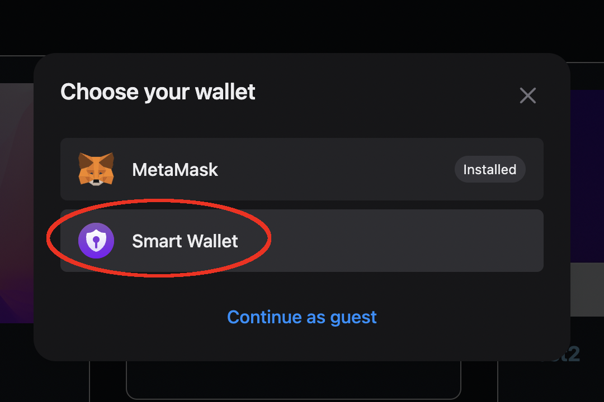

「Link Personal Wallet」から、このアカウントに接続するためのウォレットを選択します。

ここでは、メタマスクからの接続を実装しています。
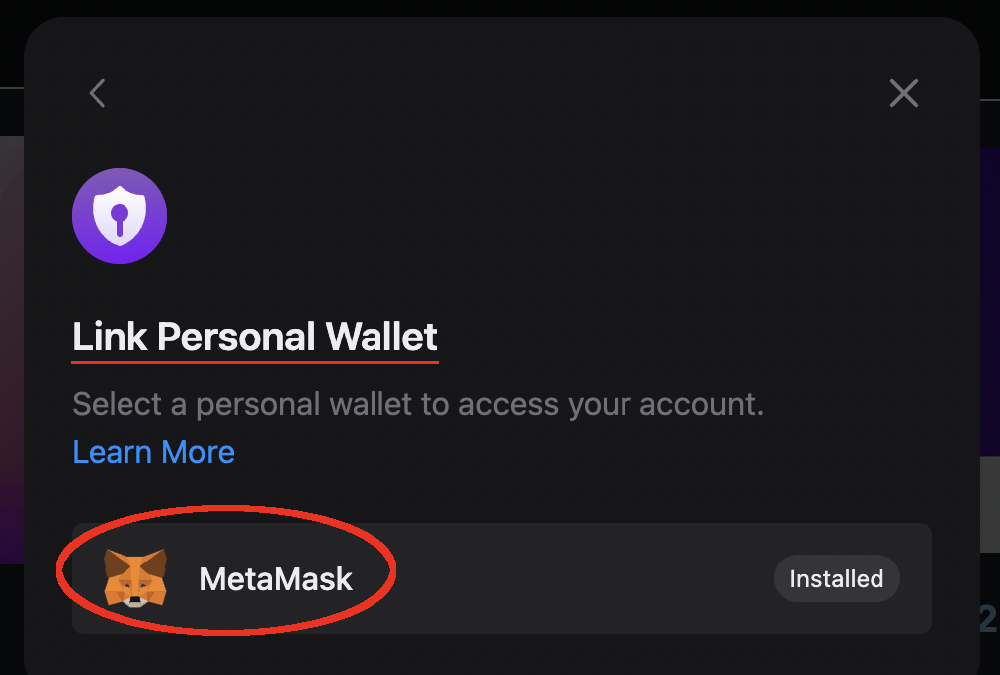

これで、スマートウォレットが作成できました。

なお、作成したばかりのため、スマートウォレットにはトークンがありません。
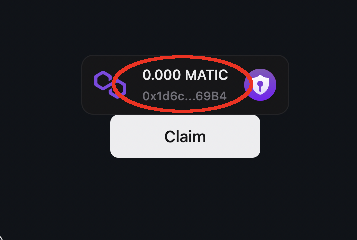


Claim実行時に、実際にトランザクションを行うのは,thirdwebのバンドラーアカウントになります。

そのため、今回はガス代は必要ありません。

（これは、mumbaiがテストトークンであり、thirdwebがガス代を要求していないためです。
　メインネットではガス代が必要だと考えております。）
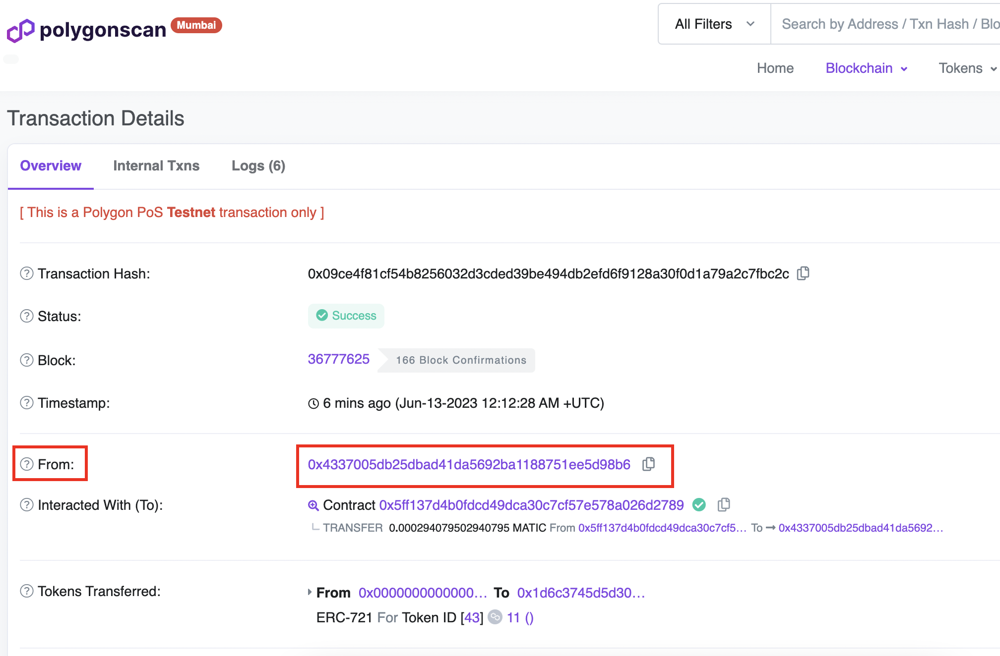
https://mumbai.polygonscan.com/tx/0x09ce4f81cf54b8256032d3cded39be494db2efd6f9128a30f0d1a79a2c7fbc2c

実際に処理を行う、EntryPointコントラクトはこちらで、これはthirdwebのものを利用しています。
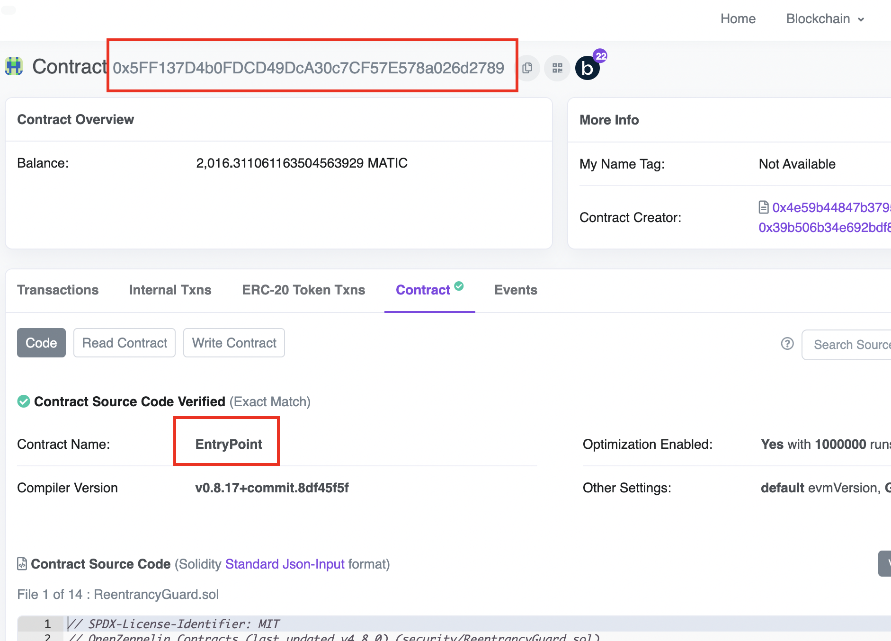
https://mumbai.polygonscan.com/address/0x5ff137d4b0fdcd49dca30c7cf57e578a026d2789#code

### 3.thirdwebの「Simple Wallet Factory」について

今回、thirdwebを使用し、スマートウォレット作成のためのFacrtoryコントラクトを作成します。

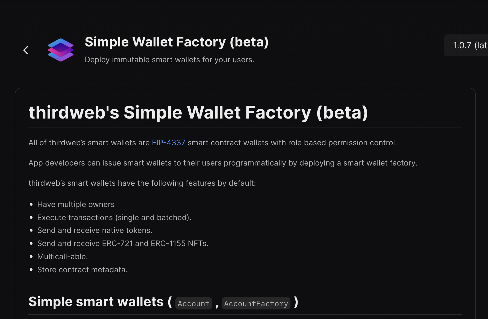

https://thirdweb.com/thirdweb.eth/AccountFactory

次のように、コントラクトを作成しました。

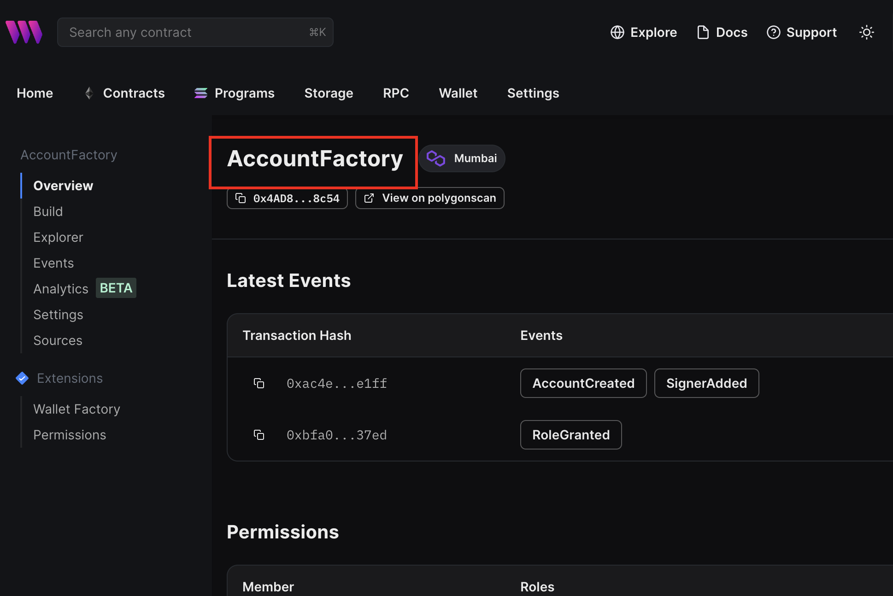

https://thirdweb.com/mumbai/0x4AD8B5a13114d44183f68250898cB546CADd8c54


### 4.実装コード箇所について

こちらが実装箇所になります。

「factoryAddress」に上で設定したコントラクトアドレスを、「thirdwebApiKey」に別で取得した、thirdwebのAPIキーを設定しています。

「gasless」を「true」としてガスレストランザクションを実施し、「PersonalWallet」に接続元であるメタマスクを入れています。
```ts:_app.tsx
<ThirdwebProvider 
      activeChain={activeChain}
      supportedWallets={[
        metamaskWallet(),
        smartWallet({
          factoryAddress: process.env.NEXT_PUBLIC_FACTORY_ADDRESS!,
          thirdwebApiKey: process.env.NEXT_PUBLIC_API_KEY!,
          gasless: true,
          personalWallets:[
            metamaskWallet()
          ]
        })
      ]}
      >
```

以上がスマートウォレットを使用したNFTの取得になります。

## Getting Started

Create a project using this example:

```bash
npx thirdweb create --template next-typescript-starter
```

You can start editing the page by modifying `pages/index.tsx`. The page auto-updates as you edit the file.

On `pages/_app.tsx`, you'll find our `ThirdwebProvider` wrapping your app, this is necessary for our [hooks](https://portal.thirdweb.com/react) and
[UI Components](https://portal.thirdweb.com/ui-components) to work.

### Deploy to IPFS

Deploy a copy of your application to IPFS using the following command:

```bash
yarn deploy
```

## Learn More

To learn more about thirdweb and Next.js, take a look at the following resources:

- [thirdweb React Documentation](https://docs.thirdweb.com/react) - learn about our React SDK.
- [thirdweb TypeScript Documentation](https://docs.thirdweb.com/typescript) - learn about our JavaScript/TypeScript SDK.
- [thirdweb Portal](https://docs.thirdweb.com) - check our guides and development resources.
- [Next.js Documentation](https://nextjs.org/docs) - learn about Next.js features and API.

You can check out [the thirdweb GitHub organization](https://github.com/thirdweb-dev) - your feedback and contributions are welcome!

## Join our Discord!

For any questions, suggestions, join our discord at [https://discord.gg/thirdweb](https://discord.gg/thirdweb).

